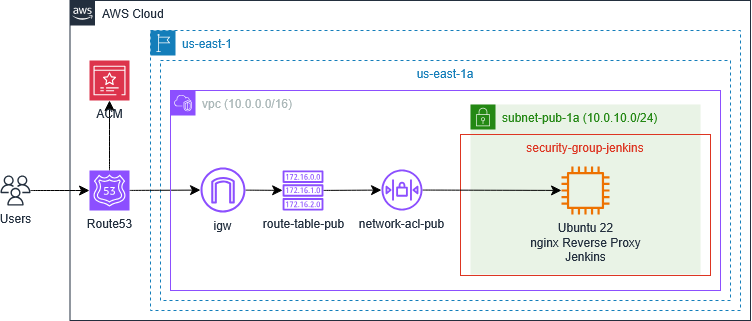

# Terraform Scripts to Create a Secure Jenkins Server on AWS 
The Terraform and AWS User Data Bash scripts in this repository create a secure single-node Jenkins server on AWS with an nginx reverse proxy and Certbot SSL/TLS certificate. The AWS User Data scripts are generated from Terraform templates for either Ubuntu 22 or Amazon Linux 2023 (AL2023).

Shown below is an architectural diagram of the resources created by the jenkins-ubuntu22.tfvars file located in the root directory. This file provides an example of how to customize the Terraform scripts, creating one Jenkins server instance hosted at jenkins-ubuntu22.example.com. The example.com domain is simply a placeholder, and a functional user-provided domain must be used to successfully deploy the servers, as documented in the [Usage](#Usage) section below.



To create an identical infrastructure using an Amazon Linux 2023 instance, refer to the jenkins-al2023.tfvars file, also located in the root directory. 

Before customizing and launching the script, review the resources that will be created, as some resources may not be free tier eligible. Please refer to the [Amazon Pricing](https://aws.amazon.com/pricing/) page for specific regional pricing.  

## Terraform Modules Overview
The root module [main.tf](./main.tf) calls the child modules described below, sending values from the root module .tfvars file and various module outputs.

### `networking` Module
Creates an AWS network infrastructure consisting of a VPC, internet gateway (IGW), NAT gateways, public and private subnets, route tables for each subnet, network access control lists (NACL), and security groups.
### `jenkins` Module
Deploys AWS EC2 instances from images listed in datasources.tf, runs an AWS User Data script to apply security measures and install Jenkins, and uploads public keys to enable access to each instance.
### `route53` Module 
Generates an AWS ACM certificate and Route 53 domain verification and website DNS records.

## AWS User Data Bash Scripts Overview
The AWS User Data Bash script installs and configures the software packages described below.

### Security-Related Software Configurations
The table below lists the security-related software configurations applied by the AWS User Data Bash scripts, along with any distribution-specific notes as applicable.

|Security-Related Software Configuration|Ubuntu 22|AL2023|
|--------|---------|------|
|Automatic security updates|unattended-upgrades|dnf-automatic|
|SSH user with sudo permissions|ssh_ubuntu|ssh_al|
|sshd_config updates to increase security|-|-|
|Firewall to limit ports to 80, 443, and custom SSH|UFW|nftables|
|Linux Security Modules|AppArmor|SELinux|
|nginx reverse proxy|Uses sites-enabled for config|Uses conf.d for config|
|Certbot with nginx plugin|Uses standard timer|Uses custom timer| 
|Fail2ban (with SSH jail)|-|-|

### Jenkins-Related Software Packages

+ Jenkins
+ Java (required dependency for Jenkins)
+ Git
+ Terraform
+ Kubectl

**Note:** Git, Terraform, and Kubectl are optional but included because the binaries are commonly required for DevOps projects.

## Getting Started

### Dependencies

+ Terraform (For installation instructions, [click here](https://developer.hashicorp.com/terraform/tutorials/aws-get-started/install-cli).)
+ AWS CLI (For installation instructions, [click here](https://docs.aws.amazon.com/cli/latest/userguide/getting-started-install.html).)
+ Established connection to an AWS account (For CLI configuration instructions, [click here](https://docs.aws.amazon.com/cli/latest/userguide/getting-started-quickstart.html).)

### Installation
To install the script, either clone the [jenkins-terraform-nginx-aws](.) repo or download the files to the local host. 

## Usage
Follow the steps outlined below to configure and run the Terraform scripts.

### Step 1. Configure Terraform Backend
The root `backend.tf` file uses an S3 backend with DynamoDB to store state files and purposely includes placeholder values for the backend attributes, which are read from the `backend.cnf` file. Update the values in `backend.cnf` as necessary if using S3 as a backend. For a discussion of the various Terraform backend configuration options, [click here](https://developer.hashicorp.com/terraform/language/backend).

### Step 2. Customize the .tfvars File
The settings for the AWS networking, Route 53, and Jenkins EC2 resources are contained in a .tfvars file, which is passed to Terraform at runtime. This file must be customized before provisioning resources with Terraform.

While most of the variables correspond to standard AWS Terraform module attributes, there are some custom variables that require specific attention. In particular, please note the following variables:

+ Project Variables
  + project: Name of the project
  + env: Environment, e.g. Dev, Test, Prod
+ Jenkins EC2 Module
  + public_key: The location on the local machine of the SSH public key.
  + ami: Reference to the Amazon Machine Image. The module's datasources.tf file contains two possible AMIs, Ubuntu 22 (ubuntu_22) or Amazon Linux 2023 (amazon_linux_2023).
  + ssh_ip: The SSH IPv4 address that will be allowed by OpenSSH, Fail2ban, and the instance firewall. This value must correspond with the SSH IPv4 address allowed by the Security Groups and NACLs. The value is currently set to "0.0.0.0/0" but for increased security should be modified throughout to a more specific address.
  + ssh_port: The SSH port that will be allowed by OpenSSH, Fail2ban, and the instance firewall. This value must correspond with the SSH port allowed by the Security Groups and NACLs. 
  + domain_name: The domain name for the Jenkins server, which must be a subdomain of the domain managed by the AWS Hosted Zone.
  + certbot_email: Valid email address, which is required by Certbot to issue the Let's Encrypt SSL/TLS certificate.
+ Route53 Module
  + zone_id: Valid AWS Route53 Zone Id for a Hosted Zone.

### Step 3. Run the Terraform Scripts 
To run the script, follow standard Terraform practices by navigating to the directory that holds the root `main.tf` script, then running the commands to initialize and apply the script. In this case, because the script employs a .tfvars file, the `-var-file` command line option is used.

```bash
terraform init -backend-config="backend.cnf"
terraform plan -var-file="jenkins-ubuntu22.tfvars"
terraform apply -var-file="jenkins-ubuntu22.tfvars"
```

### Step 4. Confirm Certbot Auto-Renewals (Optional)
By default, the Ubuntu 22 APT install of Certbot creates a systemd timer to check the status of the Let's Encrypt certificate and auto-renew if it is set to expire within 30 days. Instantiating the Certbot auto-renewal on Amazon Linux 2023, however, requires the creation of a custom systemd service and timer, both of which are generated by the AWS User Data script. On both Ubuntu 22 and Amazon Linux 2023, viewing the Let's Encrypt logs after the timer's first run will confirm whether the auto-renewals have been configured successfully:

```bash
sudo tail /var/log/letsencrypt/letsencrypt.log
```

To confirm the certificate will be renewed properly, the following commands simulate the Certbot renewal process:
 
+ Ubuntu 22: `sudo certbot renew --dry-run`
+ AL2023: `sudo /opt/certbot/bin/certbot renew --dry-run`

## License
Licensed under the [GNU General Public License v3.0](./LICENSE).
